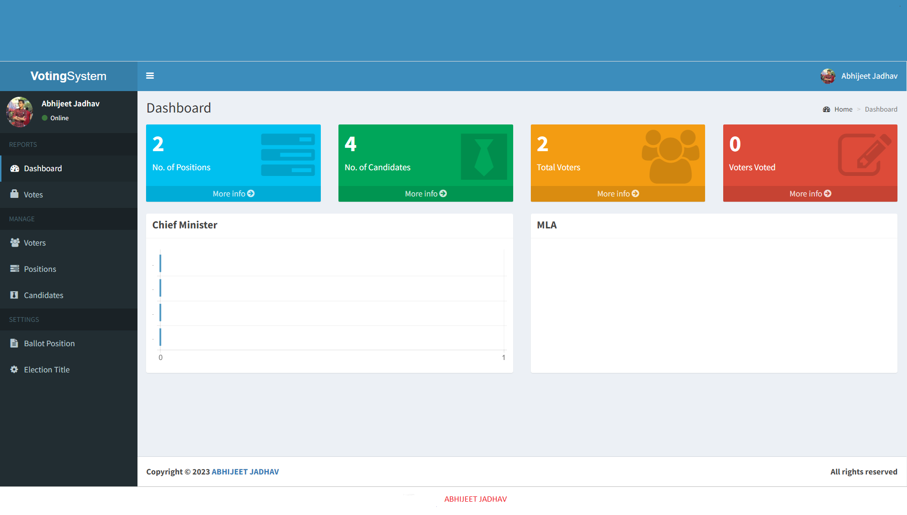

<div align="center">
  
  
  [](https://instagram.com/developer_abhii?igshid=ZDdkNTZiNTM=)


  <h2 align="center">Online_Voting_System</h2>

  This is a fully responsive website, <br />Responsive for all devices, build using PHP.
  
  <a href="#"><strong>➥ Live Demo</strong></a>
</div>

### Demo Screeshots



### Prerequisites

Before you begin, ensure you have met the following requirements:

* [Git](https://git-scm.com/downloads "Download Git") must be installed on your operating system.

### Run Locally

To run this project you must have installed virtual server i.e [XAMPP](https://www.apachefriends.org/download_success.html) on your pc (for Windows). Voting system in PHP is free to download with source code, Use for educational purposes only! 

1st Step: Extract file

2nd Step: Copy the main project folder

3rd Step: Paste in xampp/htdocs/

Now Connecting Database

4th Step: Open a browser and go to URL “http://localhost/phpmyadmin/”

5th Step: Then, click on databases tab

6th Step: Create database naming “votesystem” and then click on import tab

7th Step: Click on browse file and select “votesystem.sql” file which is inside “xampp/htdocs/database(db)” folder

8th Step: Click on go.

After Creating Database,

9th Step: Open a browser and go to URL “http://localhost/votesystem/”

For Admin Panel

Final Step: Go To URL “http://localhost/votesystem/admin/”

Insert the username and password which is

harie(username) & Admin@123(password)


Windows:

```bash
git clone https://github.com/abhijeet1681/online_voting_system.git
```

### Contact

If you want to contact with me you can reach me at [Linkedin](www.linkedin.com/in/abhijeet-jadhav-30b625211).

### License

This project is **free to use** and does not contains any license.
